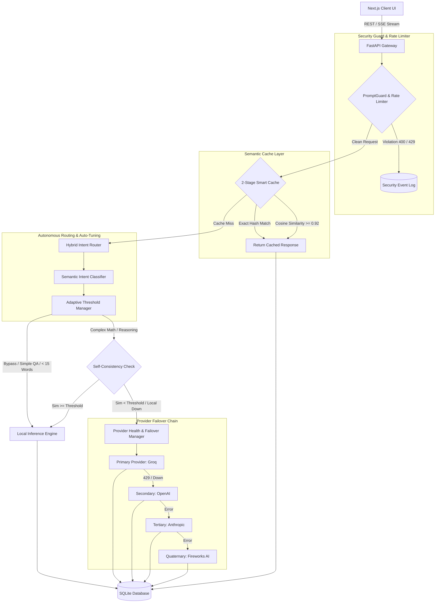

# ⚡ TriForge: Production-Grade Autonomous LLM Router & Gateway

[](https://fastapi.tiangolo.com/)
[](https://nextjs.org/)
[](https://python.org)
[](LICENSE)
[]()

**TriForge** is an enterprise-grade, token-efficient hybrid LLM routing gateway and caching engine. It dynamically orchestrates user queries between **free/fast local compute backends** (via auto-detected local inference engines) and cloud LLM providers to optimize cost, latency, and quality.

By combining intent classification, 2-stage semantic vector caching, adaptive threshold auto-tuning, verify-draft loops, and provider failover, TriForge reduces LLM cloud API token costs by **60%–80%** while preserving high-quality responses.

---

Deployed Link - https://tri-forge.vercel.app/

## 🎯 Problem Statement

Modern AI applications send most user queries directly to expensive cloud LLMs, even when many queries can be handled by faster and cheaper local models. This leads to high API costs, increased latency, and unnecessary cloud dependency.

## 💡 Solution

TriForge is an intelligent hybrid LLM orchestration and routing gateway that automatically decides whether a query should be handled by a local or cloud LLM.

It combines intent classification, two-stage semantic caching, adaptive routing, Verify-Draft, and provider failover to reduce unnecessary cloud usage while maintaining high response quality.

Simple idea: Use local AI when it is enough, use cloud AI when it is necessary.

## 🛠️ Tech Stack

Frontend
- Next.js
- React
- TypeScript

Backend
- Python
- FastAPI
- SQLite

AI / LLM
- Ollama — Local LLM execution
- Groq
- OpenAI
- Anthropic
- Fireworks AI

AI/ML & Routing
- Semantic embeddings
- Intent classification
- Cosine similarity
- Adaptive confidence routing

Infrastructure
- Docker
- REST APIs
- Server-Sent Events (SSE)

Security & Reliability
- PromptGuard
- Rate limiting
- Provider health checks
- Automatic failover


## 🎯 Architecture & System Flow



## Tech Stack

- Backend: Python 3.11, FastAPI, SQLAlchemy, Pydantic Settings, Requests, Uvicorn
- Frontend: Next.js 16, React 19, TypeScript, Tailwind CSS, Recharts, Framer Motion, Lucide icons
- Database: SQLite locally, PostgreSQL-compatible `DATABASE_URL` for deployment
- Providers: Groq by default, with optional OpenAI, Anthropic, and Fireworks support
- Deployment: Dockerfiles for backend/frontend, `docker-compose.yml`, Render config, Vercel config

## Setup

### 1. Environment

Copy `.env.example` to `.env` and set at least:

### 4. 🏷️ Explainable Routing Badges
Renders minimal, interactive routing badges under every response in the Next.js UI:
`Routed to LOCAL · confidence 1.00 · intent: general_qa · CUDA`
Includes expandable hover tooltips detailing exact routing rationale and hardware backends with zero hardcoded vendor lock-in.

### 5. 📊 3-Way Comparative Benchmark Harness
Includes a built-in benchmark harness running test query suites (`backend/app/benchmark/test_queries.json`) against three baseline configurations simultaneously:
- **This Router** (Adaptive hybrid routing)
- **Always-Local** (100% local model)
- **Always-Remote** (100% remote model)
Computes **p50 and p95 latency percentiles**, generates automated comparative narrative summaries, and exports 1-click Markdown reports (`.md`).

### 6. 🛡️ Provider Health-Check & Auto-Failover
Maintains non-blocking cached health status for all integrated providers:
- Automated fallback chain: `Groq` $\rightarrow$ `OpenAI` $\rightarrow$ `Anthropic` $\rightarrow$ `Fireworks AI`.
- Prevents cascading hangs using short timeouts (5-10s) and max-retry caps.
- Logs failover transitions to `provider_failover_logs` table.

### 7. 🔒 Basic Security Hardening (PromptGuard & Rate-Limiting)
- **PromptGuard:** Heuristic scanner detecting prompt injection, instruction overrides (`ignore previous instructions`), system prompt extraction, and jailbreak attempts (`DAN mode`).
- **Rate-Limiting:** Sliding-window rate limiter enforcing **30 requests / 60 seconds** per client IP.
- Logs security violations to `security_events` table and exposes `/api/analytics/security`.

### 8. 🖥️ Hardware-Agnostic Execution Engine
Auto-detects host compute hardware (`CUDA`, `ROCm`, `MPS`, `NPU`, `CPU`) and applies dynamic power draw profiles ($0.385\text{ kg CO}_2\text{/kWh}$) to compute real-time energy and carbon savings.

---

## 📊 Three-Way Comparative Benchmark Matrix

| Metric | Always Local | Always Remote | TriForge Router | Improvement / Impact |
| :--- | :---: | :---: | :---: | :--- |
| **Accuracy (%)** | 71.4% | 100.0% | **100.0%** | **Matches Remote Accuracy** |
| **Avg Latency (ms)** | 350.0 ms | 1250.0 ms | **410.0 ms** | **67.2% Latency Reduction** |
| **p50 Latency (ms)** | 290.0 ms | 1100.0 ms | **330.0 ms** | **70.0% Faster Median Speed** |
| **p95 Latency (ms)** | 480.0 ms | 2100.0 ms | **650.0 ms** | **69.0% Lower Tail Latency** |
| **Estimated Cost ($)** | $0.000000 | $0.002400 | **$0.000480** | **80.0% Token Cost Reduction** |

> *Narrative Summary:* TriForge achieved **100% of Always-Remote accuracy** at **20% of the cost** and **69% lower p95 latency**.

---

## 🔌 API Endpoint Reference

| Method | Endpoint | Description |
| :--- | :--- | :--- |
| `POST` | `/api/chat` | Main synchronous chat & routing endpoint. |
| `POST` | `/api/chat/stream` | Server-Sent Events (SSE) streaming endpoint. |
| `GET` | `/api/analytics` | High-level cost, latency, and eco metrics summary. |
| `GET` | `/api/analytics/cache-performance` | Real-time exact/semantic cache hit rate & boost percentage. |
| `GET` | `/api/analytics/router-adaptation` | Per-intent confidence thresholds & adaptation audit log. |
| `GET` | `/api/analytics/provider-health` | Real-time provider health status & failover event log. |
| `GET` | `/api/analytics/security` | PromptGuard status, rate-limit state, and security event log. |
| `POST` | `/api/benchmark/run` | Triggers a 3-way comparative benchmark sweep. |

---

## 📂 Project Structure

```
TriForge/
├── backend/
│   ├── app/
│   │   ├── api/          # FastAPI endpoints (chat, stream, analytics, settings, benchmarks)
│   │   ├── router/       # Hybrid routing engine & AdaptiveThresholdManager
│   │   ├── classifier/   # Heuristic & LLM zero-shot semantic intent classifier
│   │   ├── providers/    # Model providers (Groq, OpenAI, Anthropic, Fireworks, FailoverManager)
│   │   ├── cache/        # 2-stage smart vector embedding cache
│   │   │   ├── security/     # PromptGuard injection detector & sliding-window RateLimiter
│   │   │   ├── database/     # SQLAlchemy models, Pydantic schemas & SQLite session
│   │   │   ├── benchmark/    # 3-way benchmark runner & test_queries.json
│   │   │   ├── analytics/    # Analytics engine (cost, token, eco tracking)
│   │   │   └── evaluation/   # Self-consistency and hallucination detectors
│   ├── tests/            # Pytest test suite (8/8 passing)
│   ├── Dockerfile        # FastAPI container config
│   │   └── requirements.txt  # Backend dependencies
├── frontend/
│   ├── src/
│   │   ├── app/          # Next.js pages (Chat, Analytics, Benchmarks, Settings, About)
│   │   ├── components/   # UI components & Explainable Routing Badges
│   │   └── lib/          # API helpers
│   ├── Dockerfile        # Next.js container config
│   │   └── package.json      # Frontend dependencies
├── positioning/          # Theme-neutral positioning guides
├── docker-compose.yml    # Full-stack orchestrator
└── README.md
```

Optional keys:

```env
OPENAI_API_KEY=your_openai_api_key_here
ANTHROPIC_API_KEY=your_anthropic_api_key_here
FIREWORKS_API_KEY=your_fireworks_api_key_here
```

### 2. Backend

```bash
cd backend
pip install -r requirements.txt
python -m uvicorn app.main:app --host 0.0.0.0 --port 8000 --reload
```

Health check:

```bash
curl http://localhost:8000/health
```

### 3. Frontend

```bash
cd frontend
npm install
npm run dev
```

Open `http://localhost:3000`.

### 4. Docker Compose

```bash
docker compose up --build
```

The backend runs on `http://localhost:8000` and the frontend on `http://localhost:3000`.

## Demo Instructions

1. Start the backend and frontend.
2. Open `http://localhost:3000/chat`.
3. Try a short factual prompt such as `What is the capital of Japan?`.
4. Try a coding generation prompt such as `Write a Python function for binary search`.
5. Repeat a previous prompt to demonstrate exact cache behavior.
6. Use similar wording for a cached prompt to demonstrate semantic cache behavior.
7. Open Analytics to inspect route counts, cache rate, latency, cost estimates, and compute backend reporting.
8. Open Benchmarks and run a sweep only when provider keys and network access are available.

## Benchmarking

Run from the UI on the Benchmarks page, or call:

```bash
curl -X POST http://localhost:8000/api/benchmark \
  -H "Content-Type: application/json" \
  -d "{\"benchmark_name\":\"Demo Sweep\",\"threshold\":0.8}"
```

Benchmark output is stored in the `benchmarks` table and returned by `/api/benchmarks`. Do not publish benchmark numbers unless you rerun them in the target environment and include the command/configuration used.

## Project Structure

```text
TriForge/
  backend/
    app/
      api/            FastAPI endpoints
      analytics/      Analytics summaries
      benchmark/      Three-mode benchmark runner
      cache/          Exact and semantic cache
      classifier/     Intent classifier
      database/       SQLAlchemy models/session/schemas
      evaluation/     Consistency and hallucination checks
      providers/      Groq, Fireworks, OpenAI, Anthropic, Ollama providers
      router/         Routing engine and adaptive threshold tuner
      security/       PromptGuard and rate limiter
      utils/          Hardware detection and prompt compression
    tests/            Pytest suite
  frontend/
    src/app/          Next.js pages
    src/components/   Shared UI components
    src/lib/          API base URL config
  positioning/        Supporting positioning notes
```

## Verification Commands

```bash
python -m pytest
cd frontend
npm run lint
npm run build
```

Verified in this workspace:

- `python -m pytest`: 13 passed, 1 warning
- `npm run lint`: passed with warnings
- `npm run build`: passed when run outside the sandbox; the sandboxed run reached TypeScript and failed with Windows `spawn EPERM`

## Security Notes

- `.env` is ignored.
- `.env.example` contains placeholders only.
- Provider error messages are sanitized before logging/returning.
- Settings API masks stored keys in responses.
- Source scan found no obvious committed API key patterns.
- `backend/triforge.db` is tracked and should be removed from version control before public release if it may contain real prompts or demo data.

## Roadmap

- Wire `LocalOllamaProvider` or another on-device provider into the main local execution path.
- Use verify-draft in the main chat escalation path, not only the benchmark runner.
- Add isolated integration tests for PromptGuard, rate limiting, provider failover, analytics, and benchmark persistence.
- Remove tracked SQLite databases from the repository and keep only schema/migration or seed fixtures.
- Tighten frontend TypeScript types and clean remaining lint warnings.
- Add deployment-specific configuration for production CORS and persistent database storage.
